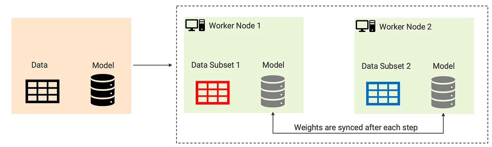
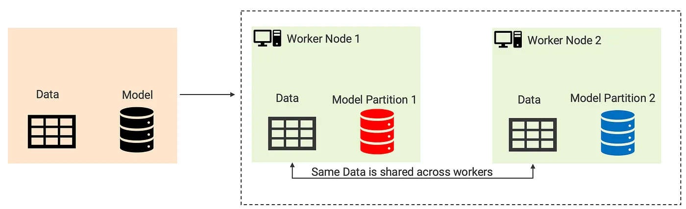

# A Guide to Distributed LLM Training and Inference

**Question:** Why do we even care? What's the benefit of distribution? 

**Answer:** Well, in the JAIL world, we deal with huge models and datasets. In the rare case that this data fits on a single node or processor, it takes a *long* time to process. Many times, you'll be hit with a dreaded *Out-of-Memory (OOM)* error instead, and you can't even run your code. Parallelism makes it possible to run scripts that are so huge they won't work. It's essential for us!

This document serves as a beginner's guide to distributed LLM training. This process involves partitioning a training workload across multiple processors, known as worker nodes. Worker nodes perform their own tasks at the same time (in parallel) to accelerate the training process.

We broadly define the two major subsets of distributed training: data parallelism and model parallelism.

## Data Parallelism

In data parallelism, training data is split across multiple machines, and a copy of the model is made on each machine and trained with its own portion of the data. Models are then synchronized (see [Synchronization](#synchronization)) to ensure that they have the same weights.

## Model Parallelism

Model parallelism splits the model itself across multiple machines, where these chunks are trained separately. 

## Synchronization
Since things are distributed, how do we end up synchronizing them again?

### Parameter Server

### All-reduce

### Message-Passing Interface

## [Fully-Sharded Data Parallelism](https://engineering.fb.com/2021/07/15/open-source/fsdp/)