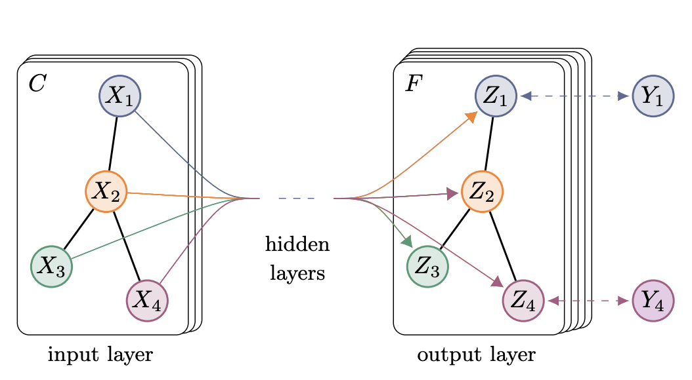

# Network Embedding Notes
Below, we cover a handful of methods for embedding networks into vector space. Each section contains an explanation of the method and suggested framework for implementation.

## 1. [Node2Vec](https://cs.stanford.edu/~jure/pubs/node2vec-kdd16.pdf)

Node2Vec is a framework for continuous, learned, and unsupervised embedding of nodes into some latent space. The method uses an objective function designed to preserve neighborhoods of nodes in a *d*-dimensional feature space.
1. First, a biased random walk is used to traverse the graph. Multiple parameters are used to control the walk:
    * **Return Parameter (p):** The return parameter dictates how likely the walker is to return to a previous node.
    * **In-out Parameter (q):** The in-out parameter dictates how likely the walker is to stay near the previous node vs traveling farther away.
    * **Walk Length (l):**
2. Repeat the random walk *r* times
3. After repetition, optimize the objective Skip-Gram function with SGD
    * Maximize the log-probability of observing a network neighorhood (*NS(u)*) for node *U* conditioned on its feature representation *f*.

The resulting output is a *d*-dimensional embedding of each node in the network.

## 2. [Simple GNN](https://distill.pub/2021/gnn-intro/)

It's possible to embed graphs with just an MLP architecture. GNNs are comprised of "blocks," with separate layers embedding the nodes *v*, edges *e*, and possibly the global state *u*. Layers can then be stacked.

We utilize pooling in order to make node- or edge-level predictions. The pooling process is as follows:
1. *Gather* embeddings of each item to be pooled and concatenate in a matrix
2. *Aggregate* the gathered embeddings (usually with a sum)

### 2.1. Message Passing
Message passing allows neighboring nodes/edges to exchange information, utilizing the connectivity structure of the graph for learning.
1. For all nodes in the graph, *gather* neighboring node embeddings (messages) in the same way as the pooling process
2. *Aggregate* messages with a sum
3. Pass pooled messages through an *update function*, which can be a neural network.

Message passing can be though of similarly to a convolution operation; node/edge objects near others influence their states.

## 2.5. [Graph Convolutional Network (GCN)](https://arxiv.org/abs/1609.02907)

Much like a traditional convolutional neural network, a GCN is designed to extract translation-invariant features across the entire graph. However, since graph data is unstructured and non-euclidean, we must reformulate the convolutional operation.

To reformulate convolutions for graphs, we use the [*convolution theorem*](https://en.wikipedia.org/wiki/Convolution_theorem), which states that the [Fourier Transform](https://en.wikipedia.org/wiki/Fourier_transform) of a convolution of two functions is equal to the pointwise product of their Fourier Transforms. 

## 3. [Graph Autoencoder (GAE)](https://arxiv.org/abs/1611.07308)

## 4. [GAT Embedding](https://arxiv.org/abs/2310.05845)

Graph Attention Transformers (GAT) are the underpinning of the Graph-LLM model. The advantage of GATs over spectral convolution methods are that they are more scalable, more intuitive, work on subnetworks, and excel at inductive reasoning problems. Here are a few examples of GAT code:

[GAT Tutorial 1](https://www.youtube.com/watch?v=AWkPjrZshug)
[GAT Tutorial 2](https://github.com/gordicaleksa/pytorch-GAT)
[GAT Tutorial 3](https://towardsai.net/p/l/graph-attention-networks-paper-explained-with-illustration-and-pytorch-implementation)
[GAT PyG Documentation](https://pytorch-geometric.readthedocs.io/en/latest/generated/torch_geometric.nn.models.GAT.html)

# Other  Considerations
It is common practice to batch process observations in neural networks. However, graphs have variable sizes, so this can be difficult. As stated in [this article](https://distill.pub/2021/gnn-intro/), the solution is to

> "...create subgraphs that preserve essential properties of the larger graph. This graph sampling operation is highly dependent on context and involves sub-selecting nodes and edges from a graph. These operations might make sense in some contexts (citation networks) and in others, these might be too strong of an operation (molecules, where a subgraph simply represents a new, smaller molecule)."

